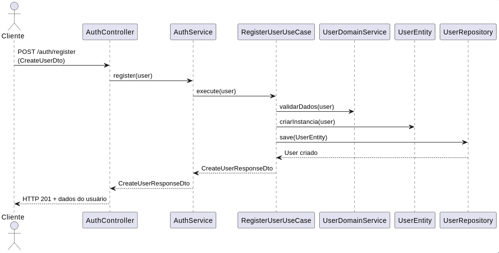

# Fluxo de Registro de Usuário

Este documento descreve o fluxo completo de registro de usuário no serviço de autenticação, detalhando cada camada envolvida no processo.

## 1. AuthController

- Recebe a requisição HTTP `POST /auth/register` com os dados do usuário (`CreateUserDto`).
- Chama o método `register` do `AuthService`, repassando os dados recebidos.

## 2. AuthService

- Recebe os dados do controller.
- Chama o caso de uso `RegisterUserUseCase` para executar a lógica de registro.

## 3. RegisterUserUseCase

- Orquestra o processo de criação do usuário.
- Realiza validações iniciais e delega regras de negócio ao `UserDomainService`.
- Cria uma instância de `UserEntity` com os dados validados.
- Chama o `UserRepository` para persistir o usuário.

## 4. UserDomainService

- Responsável por regras de negócio específicas do domínio de usuário (ex: validação de e-mail, senha, aceitação de termos).
- Pode ser chamado pelo use case para validar ou processar dados antes da persistência.

## 5. UserEntity

- Representa o usuário como objeto de domínio.
- Contém métodos e validações próprias da entidade.

## 6. UserRepository

- Responsável por persistir o usuário no banco de dados.
- O use case chama o repositório para salvar a entidade criada.

## 7. Resposta

- O resultado (usuário criado ou erro) é propagado de volta pelo fluxo até o controller.
- O controller retorna a resposta HTTP apropriada ao cliente.

---

## Diagrama do Fluxo

