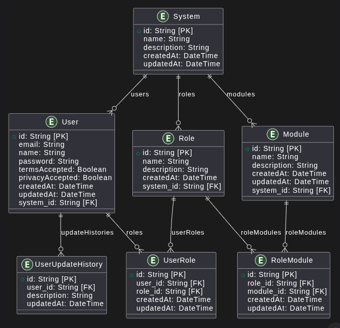

# Auth Service - Banco de Dados

## Objetivo

O banco de dados do Auth-Service foi projetado para gerenciar autenticação, autorização e controle de acesso de usuários em múltiplos sistemas, utilizando um modelo baseado em papéis (roles) e módulos.

---

## Tabelas e Relações

### 1. User

- **Descrição:** Usuários autenticáveis do sistema.
- **Campos:**
  - `id`: Identificador único do usuário
  - `email`: E-mail do usuário
  - `name`: Nome do usuário
  - `password`: Senha (hash)
  - `createdAt`: Data de criação
  - `updatedAt`: Data de atualização
  - `system_id`: Sistema ao qual o usuário pertence
  - `termsAccepted`: Para o usuário ser registrado,somente se for true
  - `privacyAccepted`: Para o usuário ser registrado,somente se for true
- **Relações:**
  - Pertence a um System (`system_id`)
  - Relaciona-se com Role via UserRole

### 2. System

- **Descrição:** Sistemas/aplicações que utilizam o Auth-Service.
- **Campos:** id, name, description, createdAt, updatedAt
- **Relações:**
  - Possui múltiplos User, Role e Module

### 3. Role

- **Descrição:** Papéis de acesso atribuíveis a usuários.
- **Campos:** id, name, description, createdAt, system_id
- **Relações:**
  - Pertence a um System
  - Relaciona-se com User via UserRole
  - Relaciona-se com Module via RoleModule

### 4. Module

- **Descrição:** Funcionalidades ou áreas do sistema controladas por permissão.
- **Campos:** id, name, description, createdAt, updatedAt, system_id
- **Relações:**
  - Pertence a um System
  - Relaciona-se com Role via RoleModule

### 5. UserRole

- **Descrição:** Associação entre User e Role (muitos-para-muitos).
- **Campos:** id, user_id, role_id, createdAt, updatedAt
- **Relações:**
  - user_id → User
  - role_id → Role

### 6. RoleModule

- **Descrição:** Associação entre Role e Module (muitos-para-muitos).
- **Campos:** id, role_id, module_id, createdAt, updatedAt
- **Relações:**
  - role_id → Role
  - module_id → Module

### 7. UserUpdateHistory

- **Descrição:** Histórico de atualizações realizadas pelo usuário, como alterações de dados ou ações relevantes.
- **Campos:**
  - `id`: Identificador único do registro
  - `user_id`: Referência ao usuário
  - `description`: Descrição da atualização realizada
  - `updatedAt`: Data/hora da atualização
- **Relações:**
  - user_id → User

---

## Termos de Uso e Privacidade

Os campos `termsAccepted` e `privacyAccepted` na tabela **User** registram se o usuário concorda com as condições apresentadas para os Termos de Uso e a Política de Privacidade, respectivamente.  
Esses registros são fundamentais para garantir conformidade legal e rastreabilidade do consentimento do usuário.

## Histórico de Atualizações do Usuário

A tabela **UserUpdateHistory** armazena o histórico de alterações feitas pelo usuário, incluindo uma descrição da ação e a data/hora em que ocorreu.

### Justificativa

- **Rastreabilidade e Auditoria:** Permite acompanhar todas as alterações feitas por um usuário ao longo do tempo, essencial para auditoria, conformidade e segurança.
- **Preservação de Dados:** Garante que o histórico de alterações não seja perdido, mesmo após múltiplas atualizações.
- **Escalabilidade:** Facilita a expansão para registrar outros tipos de eventos ou alterações no futuro.
- **Organização:** Mantém a tabela `User` enxuta, separando informações de estado atual dos registros históricos.

---

## Diagrama Resumido das Relações

```
System
 ├── User
 ├── Role
 │    └── UserRole ── User
 │    └── RoleModule ── Module
 └── Module
```

## Diagrama - Relacionamentos



---

## Observações

- O modelo suporta múltiplos sistemas, cada um com seus próprios usuários, papéis e módulos.
- O controle de acesso é feito via associação de papéis a usuários e de papéis a módulos.
- O aceite dos Termos de Uso e da Política de Privacidade é registrado individualmente para cada usuário.
